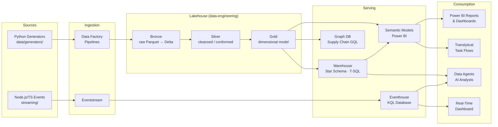
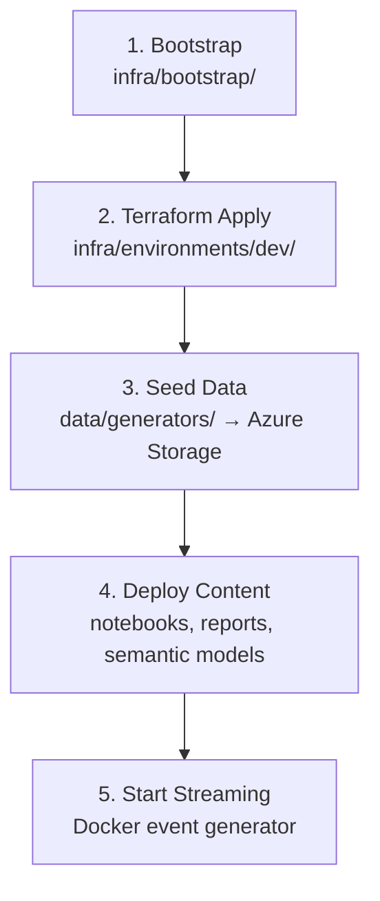

# Architecture — Contoso Global Retail & Supply Chain

> End-to-end Microsoft Fabric demo environment showcasing the full platform across retail, supply chain, IoT, and AI workloads — configurable from F2 to F64 capacity via a single `FABRIC_SKU` variable.

---

## Architecture Overview

This project deploys a cross-industry demo on **Microsoft Fabric** (default F8 capacity, configurable via `FABRIC_SKU`) with two lifecycle environments (Dev and Prod). Each environment provisions **8 purpose-built workspaces**:

| Workspace | Purpose |
|---|---|
| `contoso-ingestion-{env}` | Data Factory pipelines for source ingestion |
| `contoso-data-engineering-{env}` | Medallion Lakehouse (Bronze → Silver → Gold) |
| `contoso-data-warehouse-{env}` | Star schema warehouse (dimensions + facts) |
| `contoso-real-time-{env}` | Eventhouse, KQL database, Eventstream |
| `contoso-data-science-{env}` | ML notebooks and experiments |
| `contoso-analytics-{env}` | Power BI semantic models, reports, task flows |
| `contoso-governance-{env}` | Data lineage, cataloging, and policies |
| `contoso-ai-agents-{env}` | Data Agents (AI-powered virtual analysts) |

### Key Capabilities

- **Medallion Lakehouse** — Bronze (raw ingest) → Silver (cleansed/conformed) → Gold (dimensional model) using PySpark notebooks
- **Star Schema Warehouse** — Dimension and fact tables served via T-SQL for structured analytical queries
- **Real-Time Intelligence** — Eventhouse + KQL database for streaming analytics with sub-second latency
- **Power BI Analytics** — Semantic models, interactive reports, and translytical task flows
- **Graph in Fabric** — Supply chain relationship modeling using GQL
- **Data Agents** — AI-powered virtual analysts for sales and supply chain scenarios
- **Automated Deployment** — Terraform + Fabric CLI + GitHub Actions with OIDC

---

## Data Architecture

### Data Flow Diagram



### Batch Path (Medallion Architecture)

| Stage | Location | Technology | Content |
|---|---|---|---|
| **Sources** | `data/generators/` | Python 3.12 | Synthetic data: customers, products, stores, sales transactions, inventory, supply chain, HR employees, IoT telemetry |
| **Ingestion** | `src/pipelines/` | Data Factory | `pl_ingest_daily.json` loads raw files into Bronze Lakehouse as Parquet → Delta |
| **Bronze** | `src/notebooks/bronze/` | PySpark | `ingest_sales.py`, `ingest_inventory.py`, `ingest_dimensions.py` — raw ingestion, schema-on-read |
| **Silver** | `src/notebooks/silver/` | PySpark | `transform_sales.py`, `transform_customers.py`, `transform_supply_chain.py` — cleansing, deduplication, type enforcement |
| **Gold** | `src/notebooks/gold/` | PySpark | `dim_customer.py`, `dim_product.py`, `dim_store.py`, `fact_sales.py`, `fact_inventory.py` — dimensional model |
| **Warehouse** | `src/warehouse/` | T-SQL | Star schema: `schemas/dimensions.sql`, `schemas/facts.sql`, `schemas/staging.sql`; loaded by `pl_load_warehouse.json` |
| **Semantic Models** | `src/power-bi/semantic-models/` | Power BI | `contoso_sales.bim`, `contoso_operations.bim` |
| **Reports** | `src/power-bi/reports/` | Power BI (PBIP) | `sales_analytics.pbip`, `executive_dashboard.pbip`, `inventory_operations.pbip`, `realtime_monitoring.pbip` |
| **Task Flows** | `src/power-bi/task-flows/` | Power BI | `inventory_reorder.json`, `lead_qualification.json` |

### Real-Time Path

| Stage | Location | Technology | Content |
|---|---|---|---|
| **Event Generator** | `streaming/src/generators/` | Node.js / TypeScript | `pos_transactions.ts`, `inventory_updates.ts`, `iot_sensors.ts` — Dockerized, continuous event emission |
| **Eventstream** | Fabric Eventstream resource | Fabric | Routes events from generator to Eventhouse |
| **Eventhouse** | `contoso_eventhouse` | KQL Database | `contoso_kqldb` — ingestion via `src/kql/ingestion/realtime_sales.kql` |
| **KQL Queries** | `src/kql/queries/` | KQL | `sales_anomaly_detection.kql`, `inventory_alerts.kql`, `iot_device_health.kql` |
| **Real-Time Dashboard** | `src/kql/dashboards/` | KQL | `realtime_operations.kql` |

### Graph & AI Agents

| Component | Location | Purpose |
|---|---|---|
| **Supply Chain Graph** | `src/graph/schema/supply_chain_graph.gql` | GQL schema modeling supplier → warehouse → store relationships; queries in `src/graph/queries/` |
| **Sales Analyst Agent** | `src/ai-agents/sales_analyst_agent/` | AI-powered virtual analyst for sales questions |
| **Supply Chain Agent** | `src/ai-agents/supply_chain_agent/` | AI-powered virtual analyst for supply chain scenarios |

---

## Deployment Architecture

### Infrastructure-as-Code

All infrastructure is managed by **Terraform** using the `microsoft/fabric` and `azurerm` providers.

```
infra/
├── bootstrap/              One-time SPN + permissions setup
├── environments/
│   ├── dev/                Dev composition (main.tf, variables.tf, backend.tf, …)
│   └── prod/               Prod composition (same structure)
└── modules/                Composable, 1:1 resource-type modules
    ├── azure-storage/
    ├── fabric-capacity/
    ├── fabric-connection/
    ├── fabric-data-agent/
    ├── fabric-eventhouse/
    ├── fabric-eventstream/
    ├── fabric-graph/
    ├── fabric-lakehouse/
    ├── fabric-notebook/
    ├── fabric-pipeline/
    ├── fabric-report/
    ├── fabric-semantic-model/
    ├── fabric-warehouse/
    └── fabric-workspace/
```

**State backend:** Azure Storage account `sttfstate7524` in resource group `rg-terraform-state-prod`, container `tfstate`. Each environment uses its own state key (`fabric-e2e-dev.tfstate`, etc.).

### Content Deployment

Fabric content (notebooks, reports, semantic models) is deployed via **Fabric CLI v1.5** through helper scripts:

| Script | Purpose |
|---|---|
| `scripts/bootstrap.sh` | First-time environment bootstrap |
| `scripts/deploy-fab-cli.sh` | Deploy Fabric content artifacts |
| `scripts/seed-data.sh` | Generate and upload synthetic data |
| `scripts/upload-notebooks.sh` | Push PySpark notebooks to workspaces |
| `scripts/upload-reports.sh` | Push Power BI reports (PBIP format) |

### CI/CD — GitHub Actions

All pipelines use **OIDC** for credential-free Azure authentication. No stored secrets for Azure access.

| Workflow | File | Trigger | Description |
|---|---|---|---|
| Deploy Infrastructure | `deploy-infra.yml` | Push to `infra/**` on `main`, or manual | Two-stage: Plan → Apply (with environment approval gate) |
| Deploy Content | `deploy-content.yml` | Manual or post-infra | Fabric CLI content deployment |
| Generate Data | `generate-data.yml` | Manual | Run Python generators and upload to staging |
| Deploy Streaming | `deploy-streaming.yml` | Manual | Build and deploy Dockerized event generator |
| Destroy | `destroy.yml` | Manual only | Tear down environment (with safety gate) |

### Deployment Sequence



---

## Architecture Decision Records

ADRs capture the **why** behind significant technical decisions. They give both humans and agents the context needed to work *with* the project's direction.

Full ADR files are stored in [`docs/decisions/`](decisions/). See [decisions/README.md](decisions/README.md) for the complete index.

### Project-Specific ADRs

#### ADR-001: Composable Terraform Modules (1:1 with Resource Types)

**Status:** accepted

Each Terraform module wraps exactly one Fabric or Azure resource type (e.g., `fabric-lakehouse`, `fabric-workspace`, `fabric-eventhouse`). Environment compositions in `infra/environments/` compose these modules together.

**Why:** Enables future Backstage integration where each module maps to a catalog component. Makes modules independently testable and reusable across environments and projects.

**Trade-off:** More files and modules than a monolithic approach, but each module is small and well-scoped.

#### ADR-002: Synthetic Data Generated by Code, Never Stored in Repo

**Status:** accepted

All demo data is generated at deploy time by Python scripts in `data/generators/`. Generated output is `.gitignore`d — no CSV, Parquet, or JSON data files are committed to the repository.

**Why:** Keeps the repo lightweight, avoids stale data, and ensures data is always fresh and consistent with the current schema. Generators are deterministic (seeded) for reproducibility.

**Trade-off:** Requires Python 3.12 runtime and ~30 seconds of generation time on each seed.

#### ADR-003: Fabric-Native Resources Preferred Over External Azure Services

**Status:** accepted

When a capability exists both in Fabric and as a standalone Azure service (e.g., Event Hubs vs. Eventstream, Synapse vs. Fabric Warehouse), the Fabric-native version is preferred.

**Why:** This is a Fabric platform demo — the goal is to showcase Fabric's integrated experience. Using external services would dilute the demo narrative and add unnecessary networking complexity.

**Exception:** Azure Storage is used for Terraform state backend and staging data upload, since Fabric doesn't provide a storage account equivalent.

#### ADR-004: FabCon/SQLCon 2026 Preview Features Isolated and Toggleable

**Status:** accepted

Preview features announced at FabCon/SQLCon 2026 (translytical task flows, Data Agents, Graph in Fabric) are deployed through dedicated modules and can be toggled via Terraform variables.

**Why:** Preview features may change or break. Isolating them ensures the core demo remains stable. Toggling allows the demo to be run in environments where preview features aren't yet available.

#### ADR-005: Power BI Uses PBIP Format for Source Control Compatibility

**Status:** accepted

All Power BI reports are stored in `.pbip` (Power BI Project) format. Semantic models use `.bim` (Tabular Model) format.

**Why:** PBIP is a text-based format that diffs cleanly in Git, unlike `.pbix` which is a binary ZIP. This enables meaningful code review for report changes and makes three-way merges possible.

**Trade-off:** Requires Power BI Desktop with PBIP support enabled. The `.pbip` format is still maturing and some features may not round-trip perfectly.

---

## Technology Reference

| Layer | Technology | Version / SKU |
|---|---|---|
| Compute | Microsoft Fabric | F2–F64 (set via `FABRIC_SKU`, default F8) |
| IaC | Terraform | ≥ 1.9 |
| Fabric Provider | `microsoft/fabric` | Latest |
| Azure Provider | `hashicorp/azurerm` | Latest |
| Content Deployment | Fabric CLI | v1.5 |
| Batch Data Generation | Python | ≥ 3.12 |
| Streaming Events | Node.js / TypeScript | ≥ 22 |
| Containerization | Docker | For streaming generator |
| CI/CD | GitHub Actions | OIDC auth |
| State Backend | Azure Storage | `sttfstate7524` |

---

## Project Structure Quick Reference

```
fabric-end-2-end/
├── infra/                          Terraform infrastructure
│   ├── bootstrap/                  One-time SPN and permissions
│   ├── environments/{dev,prod}/    Environment compositions
│   └── modules/                    14 composable resource modules
├── src/                            Fabric content artifacts
│   ├── ai-agents/                  Data Agent configurations
│   ├── graph/                      GQL schema and queries
│   ├── kql/                        KQL ingestion, queries, dashboards
│   ├── notebooks/{bronze,silver,gold}/  PySpark medallion notebooks
│   ├── pipelines/                  Data Factory pipeline JSON
│   ├── power-bi/                   Reports (PBIP), semantic models, task flows
│   ├── user-data-functions/        User data functions
│   └── warehouse/                  T-SQL schemas, views, procedures
├── data/generators/                Python synthetic data generators
├── streaming/                      Node.js/TypeScript event generator (Docker)
├── scripts/                        Deployment helper scripts
├── .github/workflows/              5 GitHub Actions pipelines
└── docs/                           Architecture, conventions, guides
```
